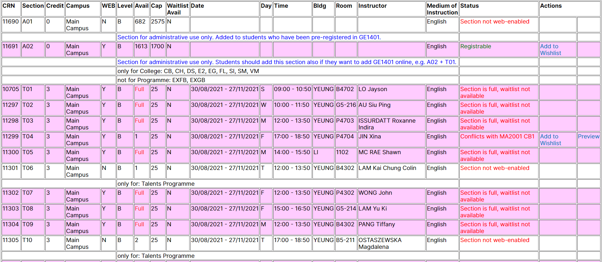

# CityU-Schedule-Planner (former CityU Timetable Checker)

此插件能够从CityU [AIMS](https://banweb.cityu.edu.hk)读取学生已有课程信息，并在原有的Master Class Schedule功能上进行强化

**这一插件仅供香港城市大学（CityU）学生使用，并仅在访问AIMS时生效。为防止增加与大学相关的不必要纠纷，此软件不会上架Chrome Store等各类插件商店。**

**特别警告软件卖家，此软件为免费软件并开源，请勿以此软件牟利。**

## 浏览器支持

此插件为Chrome插件，仅能在Chromium浏览器（如Google Chrome, Microsoft Edge等）上使用。该插件已在上述两个浏览器中测试过并保证功能完好，使用其他浏览器无法保证功能一定工作正常。

## 如何使用此插件

###
1. 登录AIMS

2. 前往**Course Registration &gt; Main Menu for Web Add/Drop &gt; My Detail Schedule.**

3. 浏览器将会自动读取已经出现在此页面上的所有课程

*注：如果某门课程还是waitlist的状态，也会被读取，受制于系统的显示逻辑，暂无法剔除*

4. 使用Master Class Schedule功能并进入任意课程详细页，插件将自动比对课程session与已有课程的冲突情况。

插件将在原有基础上增加Status和Action列，来显示该课程的状态，与既定课表之间的冲突检查结果，及用户能够进行的操作。

这一插件还提供了愿望单功能来让你存储想要选择课程的CRN。当你访问AIMS的Add/Drop Classes界面的时候，该插件能够实现自动填充(为了防止错误的注入，提交过程需要**手动**进行。)

## 如何安装

1. 自Release中下载最新压缩文件
2. 解压压缩文件到某个位置（推荐在Windows中自带的“文档”）
3. 打开浏览器插件管理界面 (比如Google Chrome的 `chrome://extensions/`，其他浏览器请自行bing)
4. 开启开发者模式.
5. 点击“加载已解压的扩展程序”.
6. 选择刚才解压的文件夹
7. 插件即被安装并启用。

## 有效期限

为了规避插件被他人上架到Chrome商店导致上架人违反大学规定等一系列问题，插件默认有效期仅有一年（即，无论是否有新功能，插件每年至少都会更新一个版本来延长有效期）。

## 状态解读

**插件将为网选课程提供多种对照结果. 非网选课程会持续显示课程非网选**

1. **不存在冲突 (绿色字样)**: 这一课程不与插件所了解到的当前课程安排存在任何冲突
2. **与 \[课程编号\] \[课程节\]存在冲突 (红色字样)**: 这一课程与插件所了解到的当前课程安排存在冲突
3. **课程节已满，等候列表可用（橘色字样）**: 这节课程已经选满，但等候列表可用且仍有余位，与状态1，2，7组合出现
4. **课程节已满，等候列表已满 (红色字样)**: 这节课程已经选满，等候列表可用但已满
5. **课程节已满，不提供等候列表 (红色字样)**: 这节课程已经选满，且不提供等候列表
6. **课程已注册 (红色字样)**: 你已经选了这门课
7. **可注册 (绿色字样)**: 课程可选，但是未有显示时间

*注：在状态4，5，6下，“添加到愿望单”这一操作不会显示。*
